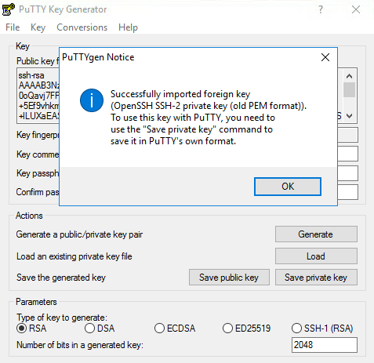
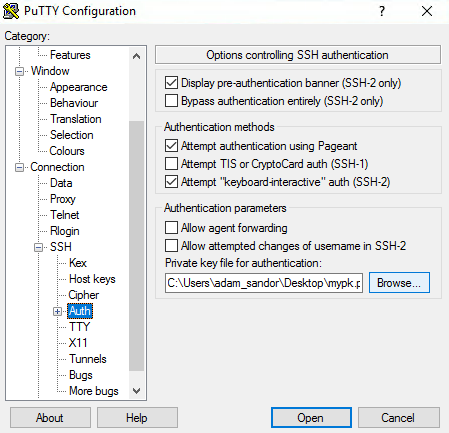
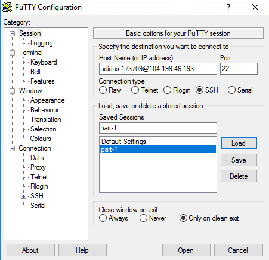

# Welcome...
## Let's get started

---

### Get the private key and your VM's IP address from the instructors

Everyone will use a separate VM and your own Kubernetes cluster

---

### Log in to your VM

* If using bash: 

`ssh -i participant-key-rsa traininguser@[IP-ADDRESS]`

* On Windows however...

---

### Installing putty

`https://the.earth.li/~sgtatham/putty/latest/w32/putty-0.70-installer.msi`

---

Using Powershell to download: 

```wget https://the.earth.li/
~sgtatham/putty/latest/w32/
putty-0.70-installer.msi -Outfile putty-inst.msi```

Once you have putty...

---

### Convert private key to putty format



---

### Setup Putty - specify private key (1/2)



---

### Setup Putty - url and save profile (2/2)


