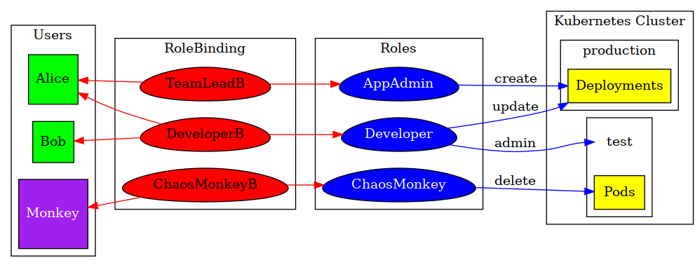

# Kubernetes RBAC
Role Based Access Control

---

# Content 

- What is it?
- Defaults roles
- Define your own roles 

---

# What is RBAC

- Control what actions user accounts can perform
    - Human users
    - Groups of users
    - Service accounts

- Also used by Kubernetes components themselves!
- Enabled since 1.6

----

## Concepts

- Rule -- grants permission
    - Applies to resource types
    - Grants verbs (create, edit, view, delete)
- (Cluster)Role
    - Cluster wide / within a namespace
    - List of rules
- (Cluster)RoleBinding
    - Connects (Cluster)Role to User
        - Both human & service account

----

## Example



- Role: verb + resources
- RoleBinding: apply Role to User / Group

---

# Default roles

- Used to restict access of Kubernetes components themselves

----

# Cluster roles


```
$ admin-kubectl get clusterroles
NAME                                           KIND
admin                                          ClusterRole.v1beta1.rbac.authorization.k8s.io
cluster-admin                                  ClusterRole.v1beta1.rbac.authorization.k8s.io
edit                                           ClusterRole.v1beta1.rbac.authorization.k8s.io
...
system:controller:attachdetach-controller      ClusterRole.v1beta1.rbac.authorization.k8s.io
...
view                                           ClusterRole.v1beta1.rbac.authorization.k8s.io

```

Note:
- Cluster wide

----

## Details of cluster roles

```
$ admin-kubectl get clusterroles admin -o yaml
apiVersion: rbac.authorization.k8s.io/v1beta1
kind: ClusterRole
metadata:
  name: admin
rules:
- apiGroups:
  - ""
  resources:
  - pods
  - pods/attach
  - pods/exec
  - pods/portforward
  - pods/proxy
  verbs:
  - create
  - delete
  - deletecollection
  - get
  - list
  - patch
  - update
  - watch
- apiGroups:
  - ""
  resources:
  - configmaps
  - endpoints
  - persistentvolumeclaims
  - replicationcontrollers
  - replicationcontrollers/scale
  - secrets
  - serviceaccounts
  - services
  - services/proxy
  verbs:
  - create
  - delete
  - deletecollection
  - get
  - list
  - patch
  - update
  - watch
- apiGroups:
  - ""
  resources:
  - bindings
  - events
  - limitranges
  - namespaces/status
  - pods/log
  - pods/status
  - replicationcontrollers/status
  - resourcequotas
  - resourcequotas/status
  verbs:
  - get
  - list
  - watch
- apiGroups:
  - ""
  resources:
  - namespaces
  verbs:
  - get
  - list
  - watch
- apiGroups:
  - ""
  resources:
  - serviceaccounts
  verbs:
  - impersonate
- apiGroups:
  - apps
  resources:
  - deployments
  - deployments/rollback
  - deployments/scale
  - statefulsets
  verbs:
  - create
  - delete
  - deletecollection
  - get
  - list
  - patch
  - update
  - watch
- apiGroups:
  - autoscaling
  resources:
  - horizontalpodautoscalers
  verbs:
  - create
  - delete
  - deletecollection
  - get
  - list
  - patch
  - update
  - watch
- apiGroups:
  - batch
  resources:
  - cronjobs
  - jobs
  - scheduledjobs
  verbs:
  - create
  - delete
  - deletecollection
  - get
  - list
  - patch
  - update
  - watch
- apiGroups:
  - extensions
  resources:
  - daemonsets
  - deployments
  - deployments/rollback
  - deployments/scale
  - ingresses
  - replicasets
  - replicasets/scale
  - replicationcontrollers/scale
  verbs:
  - create
  - delete
  - deletecollection
  - get
  - list
  - patch
  - update
  - watch
- apiGroups:
  - authorization.k8s.io
  resources:
  - localsubjectaccessreviews
  verbs:
  - create
- apiGroups:
  - rbac.authorization.k8s.io
  resources:
  - rolebindings
  - roles
  verbs:
  - create
  - delete
  - deletecollection
  - get
  - list
  - patch
  - update
  - watch
```


----

## Roles

In your default namespace

```
$ admin-kubectl get roles 
No resources found.

```

----

## Roles

In all namespaces

```
$ admin-kubectl get roles  --all-namespaces
NAMESPACE     NAME                                        KIND
kube-public   system:controller:bootstrap-signer          Role.v1beta1.rbac.authorization.k8s.io
kube-system   extension-apiserver-authentication-reader   Role.v1beta1.rbac.authorization.k8s.io
kube-system   system:controller:bootstrap-signer          Role.v1beta1.rbac.authorization.k8s.io
kube-system   system:controller:token-cleaner             Role.v1beta1.rbac.authorization.k8s.io
```

---

# Do it yourself

implementing the example

----

# Steps

1. Create namespaces
3. Create Roles
4. Create RoleBindings
5. Test!

----

# Lab

